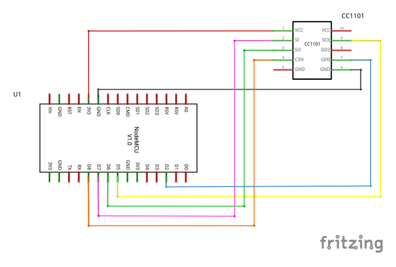

# RF decoding with ESPHome
This project provides the files to send and receive Radio Frequency signals over a CC1101 antenna connected to a
NodeMCU with an ESP8266 chipset

## Prerequisites
- NodeJS [here](https://nodejs.org/en/download)
- Python3 [here](https://www.python.org/downloads/release/python-390/)
- MQTT Broker mosquitto [here](https://mosquitto.org/download)
- ESPHome `# pip3 install esphome` (version 1.15.3 used) note: install as admin
- Node-Red `$ npm install -g node-red`

## Processing RF Data

### Locate the node-red user directory

On startup, node-red should print out a line like

`7 Nov 20:48:30 - [info] User directory : home/<name>/.node-red`

This is where node-red will keep user specific data like the flows you created, and where we can also install plugins.

### Build and install ook en/decoder

Open terminal in `<tng-automation>/node-red/on-off-keying` and run:
```
npm install
npm run build
```
Go to the **node-red user directory** (e.g. `home/<name>/.node-red`) and run
```
npm install <tng-automation>/node-red/on-off-keying
```
- Restart node-red and reload the node-red web interface
- There should now be four new nodes: "ook_decode", "ook_encode", "ook_split", "ook_concat"

### Setup Hardware

- Wire up your NodeMCU and CC1101 antenna as described in the following picture



### Start RF Decoding
- Start mqtt broker mosquitto with `mosquitto` (only necessary if auto start is disabled)
- Start node-red with `node-red` and open http://127.0.0.1:1880 in your browser
- Add a ***mqtt in*** node and configure mqtt broker and mqtt topic: `radio_transceiver/radio/433toMQTT`
- Connect the ***mqtt in*** node to a ***debug*** node and open debug window with the bug symbol in the top right corner
- Go to `<tng-automation>/esp-smarthome` and configure the radio_transceiver.yaml file
- Connect your NodeMCU with your PC and run `esphome radio_transceiver.yaml run`
- Radio Frequency signals with 433MHz are send to the specified MQTT Topic
- View RF signals in the debug window in node-red
- Send timings to the `radio_transceiver/radio/MQTTto433` topic to transmit them via the CC1101 antenna


### Use example flow
- Copy `<tng-automation>/node-red/example-flow/lib` folder into your node-red user directory
- Restart node-red
- Click the three bars in the top right corner and import example flow with `Import` > `Library` > `Example.json`
- See example flow decoding weather station information and turning wireless socket on/off

## Smartphone Apps

Apps to try out:
- [MQTT Dash(IoT, Smart Home)](https://play.google.com/store/apps/details?id=net.routix.mqttdash&hl=de) (for Android)
- [iHomeTouch](http://1j2.com/ihometouch/) (for iOS, please evaluate)